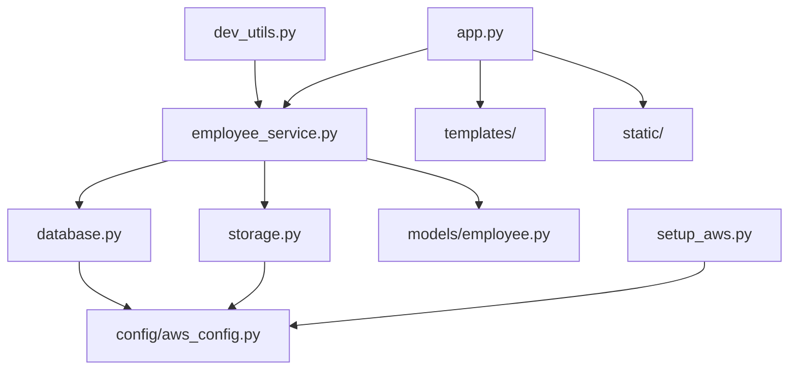

# File Directory Structure

## Project Overview
Employee Directory Application built with Flask, AWS DynamoDB, and S3

```
aws-course-employeeDirectory-s3-ec2-dynamoDB-python3/
├── 📁 Root Directory
│   ├── 📄 app.py                           # Main Flask application entry point
│   ├── 📄 setup_aws.py                     # AWS resources setup script
│   ├── 📄 dev_utils.py                     # Development utilities and helpers
│   ├── 📄 requirements.txt                 # Python dependencies
│   ├── 📄 README.md                        # Main project documentation
│   ├── 📄 ARCHITECTURE.md                  # System architecture documentation
│   ├── 📄 FILE_STRUCTURE.md               # This file - directory structure
│   ├── 📄 .env.example                     # Environment variables template
│   ├── 📄 .gitignore                       # Git ignore patterns
│   └── 📄 LICENSE                          # Project license
│
├── 📁 app/                                 # Application source code
│   ├── 📄 __init__.py                      # Python package initializer
│   ├── 📄 employee_service.py              # Business logic service layer
│   ├── 📄 database.py                      # DynamoDB data access layer
│   ├── 📄 storage.py                       # S3 storage management layer
│   │
│   ├── 📁 models/                          # Data models
│   │   ├── 📄 __init__.py                  # Package initializer
│   │   └── 📄 employee.py                  # Employee data model class
│   │
│   ├── 📁 templates/                       # Jinja2 HTML templates
│   │   ├── 📄 base.html                    # Base template with common layout
│   │   ├── 📄 index.html                   # Employee listing page
│   │   ├── 📄 add_employee.html           # Add new employee form
│   │   ├── 📄 edit_employee.html          # Edit employee form
│   │   └── 📄 view_employee.html          # Employee detail view
│   │
│   └── 📁 static/                          # Static web assets
│       ├── 📁 css/                         # Custom stylesheets
│       │   └── 📄 custom.css               # Application-specific styles
│       ├── 📁 js/                          # JavaScript files
│       │   └── 📄 app.js                   # Client-side application logic
│       └── 📁 images/                      # Static images
│           ├── 📄 logo.png                 # Application logo
│           └── 📄 default-avatar.png       # Default profile picture
│
├── 📁 config/                              # Configuration files
│   ├── 📄 __init__.py                      # Package initializer
│   ├── 📄 aws_config.py                    # AWS service configuration
│   ├── 📄 app_config.py                    # Flask application configuration
│   └── 📄 logging_config.py               # Logging configuration
│
├── 📁 docs/                                # Additional documentation
│   ├── 📄 API.md                           # API endpoint documentation
│   ├── 📄 DEPLOYMENT.md                    # Deployment instructions
│   ├── 📄 SECURITY.md                      # Security guidelines
│   ├── 📄 TROUBLESHOOTING.md              # Common issues and solutions
│   └── 📄 CHANGELOG.md                     # Version history and changes
│
├── 📁 tests/                               # Test files
│   ├── 📄 __init__.py                      # Package initializer
│   ├── 📄 test_app.py                      # Flask application tests
│   ├── 📄 test_employee_service.py        # Service layer tests
│   ├── 📄 test_database.py                # Database layer tests
│   ├── 📄 test_storage.py                 # Storage layer tests
│   ├── 📄 test_models.py                  # Model validation tests
│   └── 📁 fixtures/                       # Test data and fixtures
│       ├── 📄 sample_employees.json       # Sample employee data
│       └── 📄 test_images/                # Test profile pictures
│
├── 📁 scripts/                             # Utility scripts
│   ├── 📄 backup_data.py                  # Data backup script
│   ├── 📄 migrate_data.py                 # Data migration utilities
│   ├── 📄 seed_database.py                # Database seeding script
│   └── 📄 cleanup_storage.py              # S3 cleanup utilities
│
├── 📁 docker/                              # Docker configuration
│   ├── 📄 Dockerfile                       # Application container
│   ├── 📄 docker-compose.yml              # Multi-container setup
│   └── 📄 .dockerignore                   # Docker ignore patterns
│
└── 📁 deployment/                          # Deployment configurations
    ├── 📁 aws/                             # AWS deployment files
    │   ├── 📄 cloudformation.yaml          # Infrastructure as Code
    │   ├── 📄 lambda_function.py           # Serverless function (if used)
    │   └── 📄 iam_policies.json           # IAM roles and policies
    ├── 📁 kubernetes/                      # Kubernetes deployment files
    │   ├── 📄 deployment.yaml              # K8s deployment config
    │   ├── 📄 service.yaml                 # K8s service config
    │   └── 📄 ingress.yaml                 # K8s ingress config
    └── 📁 terraform/                       # Terraform infrastructure
        ├── 📄 main.tf                      # Main Terraform config
        ├── 📄 variables.tf                 # Variable definitions
        └── 📄 outputs.tf                   # Output definitions
```

## File Descriptions

### Root Level Files

| File | Purpose | Key Contents |
|------|---------|--------------|
| `app.py` | Main Flask application | Route definitions, app configuration, startup logic |
| `setup_aws.py` | AWS resource setup | DynamoDB table creation, S3 bucket setup |
| `dev_utils.py` | Development utilities | Sample data creation, export tools, health checks |
| `requirements.txt` | Python dependencies | Flask, boto3, and all required packages |
| `README.md` | Project documentation | Setup instructions, usage guide, features |
| `.env.example` | Environment template | AWS credentials, configuration examples |

### Application Directory (`app/`)

#### Core Application Files
| File | Purpose | Key Components |
|------|---------|----------------|
| `employee_service.py` | Business logic layer | Employee CRUD operations, file handling, validation |
| `database.py` | DynamoDB operations | Database connections, queries, data persistence |
| `storage.py` | S3 file operations | File upload/download, URL generation, cleanup |

#### Models Directory (`app/models/`)
| File | Purpose | Key Components |
|------|---------|----------------|
| `employee.py` | Employee data model | Data structure, validation, serialization methods |

#### Templates Directory (`app/templates/`)
| File | Purpose | Key Components |
|------|---------|----------------|
| `base.html` | Base template | Common layout, navigation, CSS/JS imports |
| `index.html` | Employee listing | Search, filter, employee cards, statistics |
| `add_employee.html` | Add employee form | Form fields, validation, file upload |
| `edit_employee.html` | Edit employee form | Pre-populated form, update functionality |
| `view_employee.html` | Employee details | Complete profile view, action buttons |

#### Static Directory (`app/static/`)
| Directory | Purpose | Contents |
|-----------|---------|----------|
| `css/` | Stylesheets | Custom styles, responsive design |
| `js/` | JavaScript | Form validation, AJAX, UI interactions |
| `images/` | Static images | Logos, default avatars, icons |

### Configuration Directory (`config/`)

| File | Purpose | Key Components |
|------|---------|----------------|
| `aws_config.py` | AWS settings | Credentials, regions, service endpoints |
| `app_config.py` | Flask configuration | Debug settings, secret keys, upload limits |
| `logging_config.py` | Logging setup | Log levels, formatters, handlers |

### Documentation Directory (`docs/`)

| File | Purpose | Contents |
|------|---------|----------|
| `API.md` | API documentation | Endpoint specifications, request/response formats |
| `DEPLOYMENT.md` | Deployment guide | Production setup, server configuration |
| `SECURITY.md` | Security guidelines | Best practices, vulnerability prevention |
| `TROUBLESHOOTING.md` | Problem solving | Common issues, debugging steps |

### Testing Directory (`tests/`)

| File | Purpose | Test Coverage |
|------|---------|---------------|
| `test_app.py` | Flask app tests | Route testing, request/response validation |
| `test_employee_service.py` | Service layer tests | Business logic, error handling |
| `test_database.py` | Database tests | CRUD operations, data integrity |
| `test_storage.py` | Storage tests | File operations, S3 interactions |
| `test_models.py` | Model tests | Data validation, serialization |

### Scripts Directory (`scripts/`)

| File | Purpose | Functionality |
|------|---------|---------------|
| `backup_data.py` | Data backup | Export employee data, file backups |
| `migrate_data.py` | Data migration | Schema changes, data transformations |
| `seed_database.py` | Database seeding | Sample data creation, testing setup |
| `cleanup_storage.py` | Storage cleanup | Orphaned file removal, space optimization |

### Deployment Directory (`deployment/`)

#### AWS Deployment (`deployment/aws/`)
| File | Purpose | Contents |
|------|---------|----------|
| `cloudformation.yaml` | Infrastructure as Code | AWS resource definitions |
| `lambda_function.py` | Serverless functions | Background processing, triggers |
| `iam_policies.json` | Security policies | Permissions, access control |

#### Kubernetes Deployment (`deployment/kubernetes/`)
| File | Purpose | Contents |
|------|---------|----------|
| `deployment.yaml` | K8s deployment | Pod specifications, replicas |
| `service.yaml` | K8s service | Load balancing, port configuration |
| `ingress.yaml` | K8s ingress | External access, routing rules |

#### Terraform Infrastructure (`deployment/terraform/`)
| File | Purpose | Contents |
|------|---------|----------|
| `main.tf` | Main configuration | Resource definitions, providers |
| `variables.tf` | Variable definitions | Parameterized configurations |
| `outputs.tf` | Output definitions | Resource references, endpoints |

## File Size and Complexity

### Code Metrics
| Component | Files | Lines of Code | Complexity |
|-----------|-------|---------------|------------|
| Core Application | 4 files | ~2,000 LOC | High |
| Models | 1 file | ~200 LOC | Medium |
| Templates | 5 files | ~1,500 LOC | Medium |
| Configuration | 3 files | ~300 LOC | Low |
| Tests | 5 files | ~1,000 LOC | Medium |
| Scripts | 4 files | ~800 LOC | Low |
| Documentation | 6 files | ~3,000 LOC | Low |

### File Dependencies



## Environment-Specific Files

### Development Environment
- `.env` (local configuration)
- `dev_utils.py` (development tools)
- Debug configurations in templates
- Local test data files

### Production Environment
- Environment variables (AWS Systems Manager)
- Production configuration files
- Optimized static assets
- Monitoring and logging configurations

### Testing Environment
- Test fixtures and sample data
- Mock configurations
- CI/CD pipeline files
- Test coverage reports

This file structure provides a comprehensive, scalable foundation for the Employee Directory application with clear separation of concerns and organized code architecture.